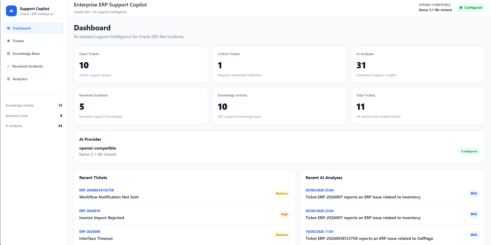
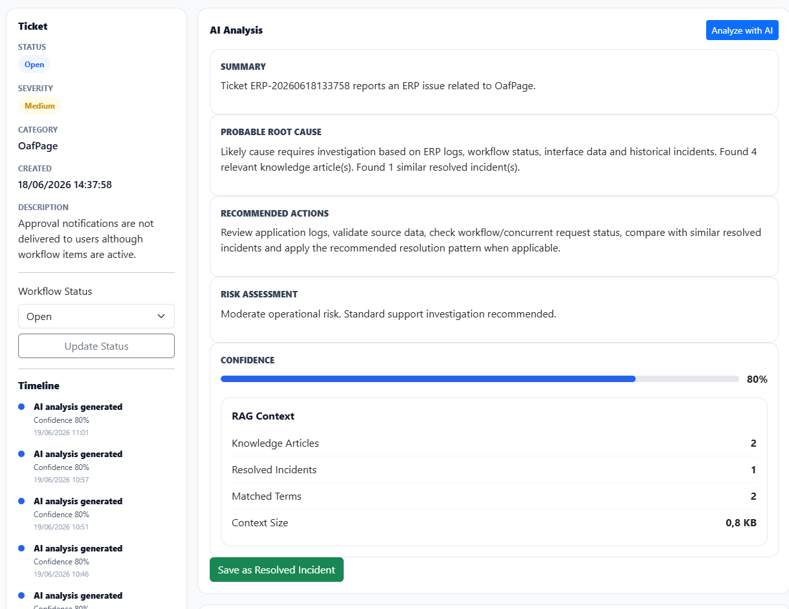
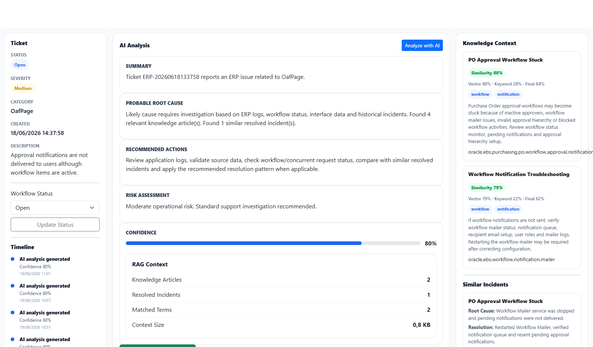
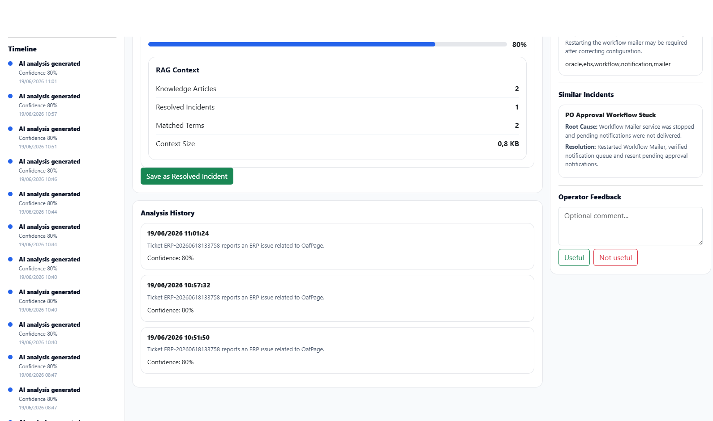

# Enterprise ERP Support Copilot

AI-powered support intelligence platform designed for ERP support teams.

The platform combines vector search, knowledge management, historical incident capitalization and LLM-powered analysis to accelerate troubleshooting and incident resolution.

---

## Vision

ERP support engineers spend significant time searching documentation, reviewing historical incidents and manually investigating recurring issues.

Enterprise ERP Support Copilot provides:

- AI-assisted ticket analysis
- Knowledge article retrieval
- Similar incident discovery
- RAG-powered recommendations
- Incident capitalization
- Operational analytics

---

## Screenshots

### Dashboard

### AI Ticket Analysis

### Knowledge Context & Similar Incidents

### Ticket Timeline

----

## Key Features

### Ticket Management

- Create and manage support tickets
- Severity and status tracking
- Category classification
- Workflow management

### AI Analysis

- Ticket summarization
- Probable root cause detection
- Recommended actions
- Risk assessment
- Confidence scoring

### Knowledge Base

- Knowledge article management
- Vector embeddings
- Semantic search
- Explainable retrieval

### Incident Capitalization

- Convert successful analyses into reusable incidents
- Historical resolution repository
- Similar incident retrieval

### RAG Pipeline

- Knowledge retrieval
- Similar incident retrieval
- Context building
- LLM analysis generation

### Hybrid Search

Combines:

- Vector search (pgvector)
- Keyword matching
- Hybrid ranking

This improves retrieval quality for ERP-specific terms such as:

- ORA errors
- APP-FND errors
- Concurrent requests
- Oracle Forms exceptions
- Workflow issues

---

## Architecture

Ticket
↓
Embedding Generation
↓
pgvector Search
↓
Knowledge Retrieval
↓
Similar Incidents
↓
RAG Context Builder
↓
Groq LLM (llama-3.1-8b-instant)
↓
AI Analysis

---

## Technology Stack

### Backend

- .NET 9
- ASP.NET Core Minimal APIs
- Entity Framework Core
- PostgreSQL
- pgvector

### AI

- Groq
- Llama 3.1 8B Instant
- Ollama
- nomic-embed-text

### Frontend

- Blazor Server
- Bootstrap

---

## Current Capabilities

- Ticket Management
- AI Analysis
- Knowledge Base
- Resolved Incidents
- Timeline
- Activity Feed
- RAG Explainability
- Hybrid Search
- Similarity Scoring

---

## Future Roadmap

- Feedback Learning Loop
- RAG Source Ranking
- Prompt Preview
- Multi-ERP Support
- Multi-Tenant Architecture
- Team Collaboration
- Export & Reporting

---

## Project Status

MVP in active development.